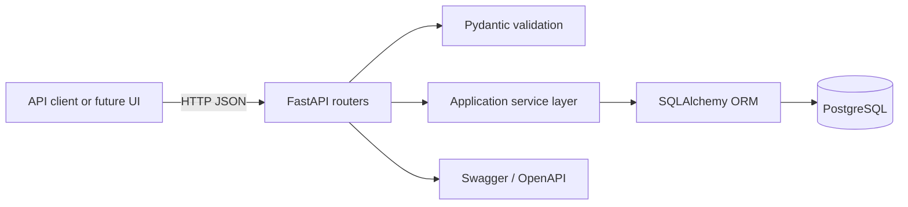

# Cloud-Based Job Application Tracker API

A cloud-ready REST API for organizing a job search in one place. The service
tracks companies, roles, pipeline status, salary ranges, recruiter and referral
contacts, interviews, notes, and follow-up dates. It is built as a modular
FastAPI application backed by PostgreSQL and packaged for repeatable local or
cloud container deployments.

This is a portfolio project, not a claim of a live production deployment.

## Problem being solved

Job searches quickly spread across spreadsheets, bookmarks, inboxes, and
calendar reminders. That makes it difficult to answer basic questions: Which
applications need follow-up? How many have reached interviews? Where did a
recruiter make contact? This API provides a validated source of truth that can
power a personal dashboard, automation, or reporting workflow.

## Features

- Create, retrieve, update, and delete job applications.
- Track ten stages from `Wishlist` through `Offer`, `Rejected`, or `Withdrawn`.
- Record salary ranges, posting URLs, locations, contacts, dates, and notes.
- Search company names and job titles without case sensitivity.
- Filter by exact status, follow-up deadline, or interview timestamp.
- View total and per-status pipeline counts.
- Validate email addresses, URLs, salary ranges, dates, IDs, and status values.
- Return clear `404`, `422`, and safe database error responses.
- Generate Swagger UI and OpenAPI 3.1 documentation automatically.
- Run with PostgreSQL and FastAPI using one Docker Compose command.
- Test the API without external services using an isolated SQLite database.
- Run automated tests and coverage checks on every push and pull request.

## Architecture



The router layer owns HTTP behavior, Pydantic schemas validate the API
contract, services manage transactions and queries, and SQLAlchemy models map
the domain to PostgreSQL. FastAPI dependencies provide one database session per
request. Configuration comes from environment variables through
`pydantic-settings`.

## Technologies

| Technology | Purpose |
| --- | --- |
| Python 3.12+ | Application language |
| FastAPI | REST API, dependency injection, Swagger/OpenAPI |
| Pydantic | Request, response, URL, email, date, and range validation |
| SQLAlchemy 2 | ORM, queries, transactions, and database abstraction |
| PostgreSQL 17 | Primary relational database |
| Psycopg 3 | PostgreSQL driver |
| Docker | Reproducible non-root API image |
| Docker Compose | Local API and PostgreSQL orchestration |
| Pytest | Automated API and business-rule tests |
| GitHub Actions | Continuous integration and coverage enforcement |

## Project structure

```text
job-application-tracker/
├── .github/workflows/ci.yml
├── app/
│   ├── models/
│   │   └── application.py
│   ├── routers/
│   │   └── applications.py
│   ├── schemas/
│   │   └── application.py
│   ├── services/
│   │   └── applications.py
│   ├── config.py
│   ├── database.py
│   └── main.py
├── tests/
│   ├── conftest.py
│   ├── test_applications.py
│   └── test_validation_and_filters.py
├── .dockerignore
├── .env.example
├── .gitignore
├── Dockerfile
├── docker-compose.yml
├── requirements.txt
└── README.md
```

## Quick start with Docker

Requirements: Docker Desktop or Docker Engine with Compose v2.

```bash
cp .env.example .env
docker compose up --build
```

Compose waits for PostgreSQL to become healthy before starting the API. Tables
are created automatically for this portfolio setup, and data persists in the
named `postgres_data` volume.

Open:

- API: <http://localhost:8000>
- Health check: <http://localhost:8000/health>
- Swagger UI: <http://localhost:8000/docs>
- ReDoc: <http://localhost:8000/redoc>
- OpenAPI JSON: <http://localhost:8000/openapi.json>

Stop the containers without deleting database data:

```bash
docker compose down
```

Use `docker compose down --volumes` only when you intentionally want to delete
the local PostgreSQL data volume.

## Run directly on the host

Start PostgreSQL separately and create a database matching the values in your
local `.env`, then run:

```bash
python3 -m venv .venv
source .venv/bin/activate
python -m pip install --requirement requirements.txt
cp .env.example .env
uvicorn app.main:app --reload
```

For a temporary SQLite development run, override the database URL:

```bash
DATABASE_URL=sqlite+pysqlite:///./job_tracker.db uvicorn app.main:app --reload
```

Never commit `.env`; it is ignored. Commit only `.env.example` with placeholder
development values.

## API endpoints

Base URL: `http://localhost:8000/api/v1`

| Method | Path | Description |
| --- | --- | --- |
| `POST` | `/applications` | Create an application |
| `GET` | `/applications` | List, search, and filter applications |
| `GET` | `/applications/stats` | Count the full pipeline by status |
| `GET` | `/applications/{id}` | Retrieve one application |
| `PATCH` | `/applications/{id}` | Partially update an application |
| `DELETE` | `/applications/{id}` | Delete an application |
| `GET` | `/health` | Container and service health check |

`GET /applications` accepts:

- `status`: exact application status
- `company`: case-insensitive partial company name
- `job_title`: case-insensitive partial title
- `follow_up_before`: ISO date, such as `2026-10-31`
- `interview_from`: ISO timestamp, such as `2026-10-01T00:00:00Z`
- `skip` and `limit`: bounded offset pagination

Supported status values:

`Wishlist`, `Applied`, `Referral Requested`, `Recruiter Screen`, `Interview`,
`Technical Interview`, `Final Interview`, `Offer`, `Rejected`, and `Withdrawn`.

## Example requests

Create an application:

```bash
curl -X POST http://localhost:8000/api/v1/applications \
  -H "Content-Type: application/json" \
  -d '{
    "company_name": "Example Cloud",
    "job_title": "Platform Engineer",
    "location": "Remote",
    "job_url": "https://example.com/jobs/42",
    "salary_min": "120000.00",
    "salary_max": "150000.00",
    "application_status": "Applied",
    "application_date": "2026-10-02",
    "follow_up_date": "2026-10-09",
    "notes": "Applied through the careers page."
  }'
```

Search and filter:

```bash
curl "http://localhost:8000/api/v1/applications?status=Interview&company=cloud"
```

Record an interview:

```bash
curl -X PATCH http://localhost:8000/api/v1/applications/1 \
  -H "Content-Type: application/json" \
  -d '{
    "application_status": "Interview",
    "interview_date": "2026-10-15T14:30:00Z"
  }'
```

## Testing

The test suite overrides the database dependency with an in-memory SQLite
engine. It never needs PostgreSQL credentials and never changes local or cloud
data.

```bash
source .venv/bin/activate
python -m pytest -v --cov=app --cov-report=term-missing --cov-fail-under=85
```

Tests cover creation, collection and single retrieval, updates, deletion, 404
responses, invalid status, invalid salary ranges, cross-field update
validation, text search, date filters, and pipeline statistics.

## CI/CD

`.github/workflows/ci.yml` runs on every push and pull request. It checks out
the repository, installs the pinned dependencies on Python 3.12, executes all
tests, prints missing coverage lines, and fails below 85% coverage. The
workflow has read-only repository permissions and performs no deployment.

The application is container- and environment-variable-based, making it ready
for a future deployment workflow, but no production hosting is claimed here.

## Future improvements

- Add Alembic migrations instead of startup table creation.
- Add authentication and per-user data ownership.
- Encrypt sensitive notes and add audit history.
- Add cursor pagination for larger datasets.
- Add reminders through a scheduled worker and email/calendar integration.
- Add a frontend dashboard with pipeline and response-rate analytics.
- Add structured logs, tracing, metrics, and managed cloud deployment.
- Split runtime and development dependencies and automate image security scans.

## What I Learned

This project demonstrates how REST resources map to predictable HTTP methods,
status codes, validation errors, and OpenAPI contracts. Separating routers,
schemas, services, and models keeps backend responsibilities understandable and
testable instead of placing all behavior in route functions.

It also demonstrates relational modeling with PostgreSQL, SQLAlchemy 2 query
patterns, per-request sessions, transaction rollback, indexes, and database
constraints. Docker and Compose turn the API/database relationship into a
repeatable environment, while environment variables keep configuration outside
source code.

The Pytest suite shows dependency overrides and database isolation for fast,
deterministic API tests. GitHub Actions makes those tests a required feedback
loop on every code change. Together, these choices form a practical foundation
for cloud-ready application development without pretending the project has
already been deployed to production.
